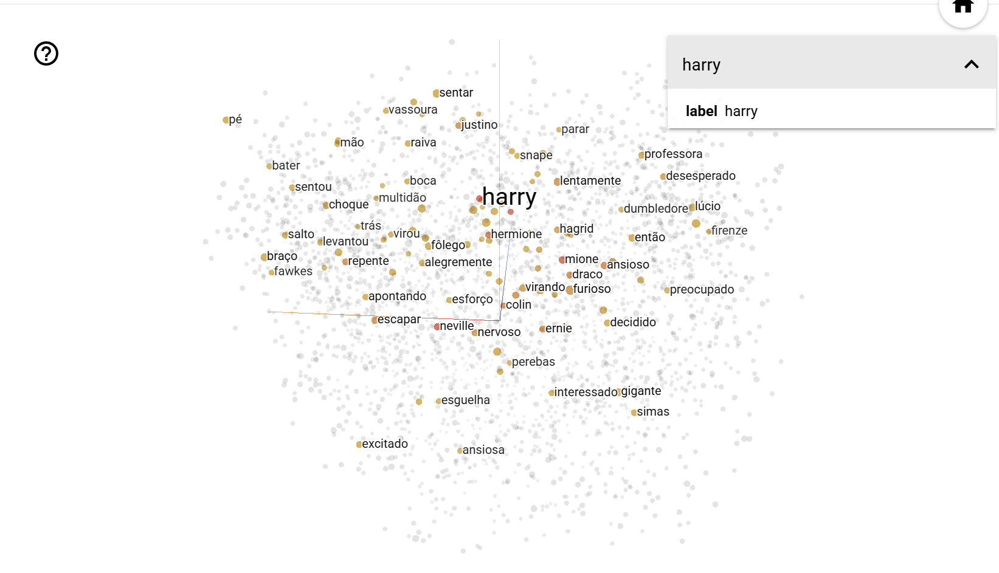

# TPC9: Word Embeddings

Para este projeto, o objetivo consistia na aplicação da biblioteca Gensim e do modelo Word2Vec a dois livros da série Harry Potter em português do Brasil, de modo a criar representações vetoriais das palavras com base no seu contexto e permitir a análise semântica entre os termos deste universo literário.

## **Preparação dos dados**

Os textos dos livros "Harry Potter e a Pedra Filosofal" e "Harry Potter e a Câmara Secreta" foram processados linha a linha, com recurso à função `gensim.utils.tokenize`, que divide cada linha em tokens. Adicionalmente, converte as palavras para minúsculas e elimina a pontuação, de modo a criar uma lista de listas de tokens (_sentences_), que é o formato necessário para a utilização do modelo `Word2Vec`.

```python

sentences = []
for line in f1:
    tokens = list(gensim.utils.tokenize(line, lower = True))
    sentences.append(tokens)

```

## **Treino do modelo Word2Vec***

Com a lista de listas de tokens _sentences_ preparada, foi treinado um modelo `Word2Vec` com os parâmetros `vector_size=300` e `epochs=20`, criando vetores numéricos para cada palavra do vocabulário.

```python

model = Word2Vec(sentences, vector_size=300, epochs=20)

``` 

## **Análise Semântica**

Após o treino, foram exploradas várias funcionalidades:

- `similarity`: mede a similaridade entre duas palavras.

Exemplo:

```python

model.wv.similarity('harry', 'hagrid')

```


```markdown
0.4930841
```


- `most_similar`: identifica palavras semanticamente próximas, tendo sido também utilizado para analogias.

Exemplo:

```python

model.wv.most_similar('grifinória')

```

```markdown
[('sonserina', 0.8730189800262451),
 ('torre', 0.8109785914421082),
 ('corvinal', 0.7898600101470947),
 ('lufa', 0.7693150043487549),
 ('escola', 0.7626890540122986),
 ('magia', 0.7505670785903931),
 ('existência', 0.7294279336929321),
 ('membro', 0.7061262726783752),
 ('pontos', 0.7006111145019531),
 ('biblioteca', 0.6852126121520996)]
```


```python

model.wv.most_similar(positive=['grifinória', 'draco'], negative=['harry'])

```

```markdown
[('sonserina', 0.6219189167022705),
 ('magia', 0.6053168773651123),
 ('corvinal', 0.5987107753753662),
 ('lufa', 0.5731778144836426),
 ('prática', 0.5701233744621277),
 ('membro', 0.5683248043060303),
 ('pontos', 0.5486354827880859),
 ('existência', 0.5414080023765564),
 ('torre', 0.5349211692810059),
 ('capitão', 0.529320478439331)]
```


- `doesnt_match`: deteta a palavra que não pertence ao grupo (intruso).

Exemplo:

```python

model.wv.doesnt_match(['harry', 'rony', 'hermione', 'draco']) 

```

```markdown
'draco'
```


## **Top 10 Palavras**

Foi feita a análise das palavras mais frequentes no modelo, removendo _stop words_ em português com recurso à biblioteca `nltk`.

```python

stopwords_pt = set(stopwords.words('portuguese'))
top_10 = model.wv.index_to_key[:100]
top_10_sem_stopwords = [w for w in top_10 if w not in stopwords_pt]
print(top_10_sem_stopwords[:10])

```

```markdown
['harry', 'disse', 'rony', 'hagrid', 'coisa', 'hermione', 'bem', 'cabeça', 'olhos', 'ter']
```

## **Guardar o Modelo**

Foi utilizada a função `save_word2vec_format` para exportar os vetores do modelo Word2Vec treinado para um ficheiro de texto, tornando possível que estes voltem a ser carregados mais tarde para outros programas ou projeots, sem ser necessário treinar o modelo novamente.

```python

model.wv.save_word2vec_format('model_harry.txt', binary = False)

```


## **Representação com PCA**

Recorreu-se ao PCA para representar visualmente os vetores de palavras do modelo Word2Vec que tinha sido anteriormente guardado (`model_harry.txt`), originando um gráfico que ilustra a relação de proximidade semântica entre algumas palavras selecionadas. Aqui, palavras com significados ou contextos semelhantes apareceram mais próximas, como é o caso dos nomes dos estudantes, que se encontram mais próximos entre si, tal como os nomes das casas.


## **Representação Visual - Tenserflow**

Por último, recorreu-se também à plataforma `projector.Tenserflow` para elaborar outro tipo de representação visual da relação semântica entre as palavras, desta vez a três dimensões. Para aqui foram carregados os ficheiros `model_harry_tensor.tsv` e `model_harry_metadata.tsv`.



